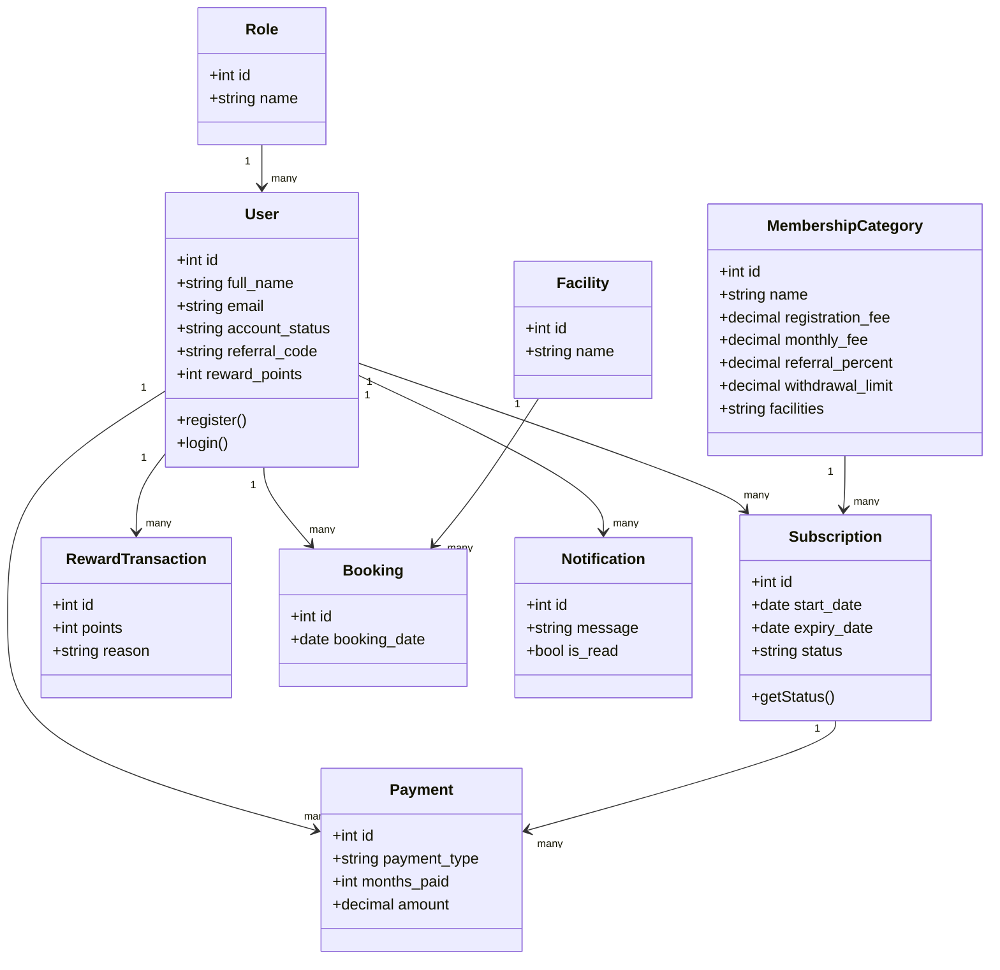

# UML Class Diagram

Main classes/entities in the system and how they connect. (Simplified — shows
the important fields and methods, not every one.)

```mermaid
classDiagram
    class User {
      +int id
      +string full_name
      +string email
      +string account_status
      +string referral_code
      +int reward_points
      +register()
      +login()
    }
    class Role {
      +int id
      +string name
    }
    class MembershipCategory {
      +int id
      +string name
      +decimal registration_fee
      +decimal monthly_fee
      +decimal referral_percent
      +decimal withdrawal_limit
      +string facilities
    }
    class Subscription {
      +int id
      +date start_date
      +date expiry_date
      +string status
      +getStatus()
    }
    class Payment {
      +int id
      +string payment_type
      +int months_paid
      +decimal amount
    }
    class RewardTransaction {
      +int id
      +int points
      +string reason
    }
    class Booking {
      +int id
      +date booking_date
    }
    class Facility {
      +int id
      +string name
    }
    class Notification {
      +int id
      +string message
      +bool is_read
    }

    Role "1" --> "many" User
    User "1" --> "many" Subscription
    MembershipCategory "1" --> "many" Subscription
    User "1" --> "many" Payment
    Subscription "1" --> "many" Payment
    User "1" --> "many" RewardTransaction
    User "1" --> "many" Booking
    Facility "1" --> "many" Booking
    User "1" --> "many" Notification
```
