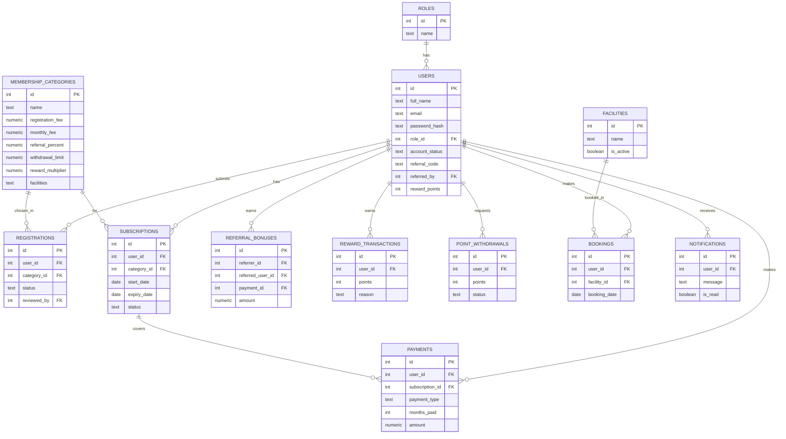

# Entity Relationship Diagram (ERD)

The database has 12 tables. Main relationships shown below.

```mermaid
erDiagram
    ROLES ||--o{ USERS : has
    USERS ||--o{ REGISTRATIONS : submits
    MEMBERSHIP_CATEGORIES ||--o{ REGISTRATIONS : chosen_in
    USERS ||--o{ SUBSCRIPTIONS : has
    MEMBERSHIP_CATEGORIES ||--o{ SUBSCRIPTIONS : for
    USERS ||--o{ PAYMENTS : makes
    SUBSCRIPTIONS ||--o{ PAYMENTS : covers
    USERS ||--o{ REFERRAL_BONUSES : earns
    USERS ||--o{ REWARD_TRANSACTIONS : earns
    USERS ||--o{ POINT_WITHDRAWALS : requests
    USERS ||--o{ BOOKINGS : makes
    FACILITIES ||--o{ BOOKINGS : booked_in
    USERS ||--o{ NOTIFICATIONS : receives

    ROLES {
      int id PK
      text name
    }
    USERS {
      int id PK
      text full_name
      text email
      text password_hash
      int role_id FK
      text account_status
      text referral_code
      int referred_by FK
      int reward_points
    }
    MEMBERSHIP_CATEGORIES {
      int id PK
      text name
      numeric registration_fee
      numeric monthly_fee
      numeric referral_percent
      numeric withdrawal_limit
      numeric reward_multiplier
      text facilities
    }
    REGISTRATIONS {
      int id PK
      int user_id FK
      int category_id FK
      text status
      int reviewed_by FK
    }
    SUBSCRIPTIONS {
      int id PK
      int user_id FK
      int category_id FK
      date start_date
      date expiry_date
      text status
    }
    PAYMENTS {
      int id PK
      int user_id FK
      int subscription_id FK
      text payment_type
      int months_paid
      numeric amount
    }
    REFERRAL_BONUSES {
      int id PK
      int referrer_id FK
      int referred_user_id FK
      int payment_id FK
      numeric amount
    }
    REWARD_TRANSACTIONS {
      int id PK
      int user_id FK
      int points
      text reason
    }
    POINT_WITHDRAWALS {
      int id PK
      int user_id FK
      int points
      text status
    }
    FACILITIES {
      int id PK
      text name
      boolean is_active
    }
    BOOKINGS {
      int id PK
      int user_id FK
      int facility_id FK
      date booking_date
    }
    NOTIFICATIONS {
      int id PK
      int user_id FK
      text message
      boolean is_read
    }
```
