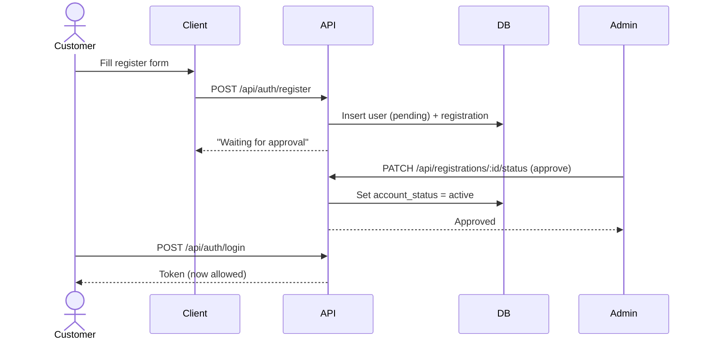
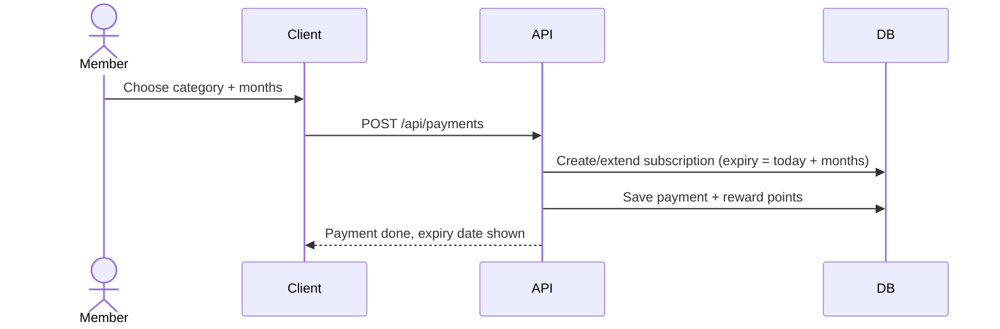
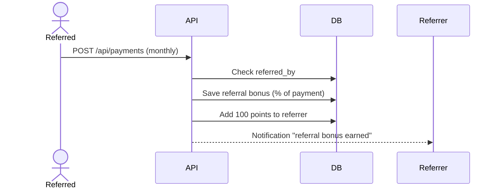

# Sequence Diagrams

Three important flows in the system.

## 1. Register and get approved

```mermaid
sequenceDiagram
    actor Customer
    participant Client
    participant API
    participant DB
    participant Admin

    Customer->>Client: Fill register form
    Client->>API: POST /api/auth/register
    API->>DB: Insert user (pending) + registration
    API-->>Client: "Waiting for approval"
    Admin->>API: PATCH /api/registrations/:id/status (approve)
    API->>DB: Set account_status = active
    API-->>Admin: Approved
    Customer->>API: POST /api/auth/login
    API-->>Customer: Token (now allowed)
```

## 2. Pay subscription (expiry auto-set)

```mermaid
sequenceDiagram
    actor Member
    participant Client
    participant API
    participant DB

    Member->>Client: Choose category + months
    Client->>API: POST /api/payments
    API->>DB: Create/extend subscription (expiry = today + months)
    API->>DB: Save payment + reward points
    API-->>Client: Payment done, expiry date shown
```

## 3. Referral bonus

```mermaid
sequenceDiagram
    actor Referred
    participant API
    participant DB
    participant Referrer

    Referred->>API: POST /api/payments (monthly)
    API->>DB: Check referred_by
    API->>DB: Save referral bonus (% of payment)
    API->>DB: Add 100 points to referrer
    API-->>Referrer: Notification "referral bonus earned"
```
