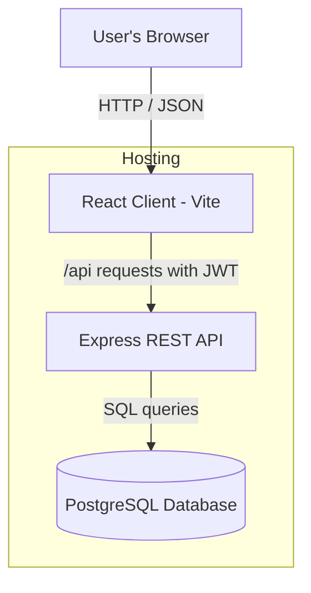

# System Architecture Diagram

Three main parts: the React frontend, the Express API, and the PostgreSQL
database. The browser talks to the API over HTTP; the API talks to the database.

## How it works

- The **React client** shows the pages and forms. It stores the login token
  and sends it with each request.
- The **Express API** checks the token, runs the logic (payments, points,
  bookings, etc.) and reads/writes the database.
- **PostgreSQL** stores all the data.

## Deployment

- Client + API deploy together on **Vercel** (client as static files, API as a
  serverless function under `/api`).
- Database runs on **Render** (managed PostgreSQL).
