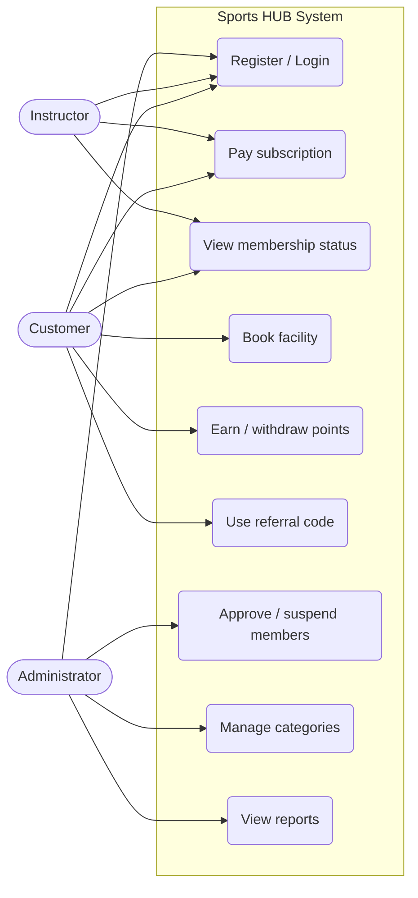

# Use Case Diagram

Actors: Customer, Instructor, Administrator.
(Customer and Instructor do the same member actions.)

```mermaid
flowchart LR
    Customer([Customer])
    Instructor([Instructor])
    Admin([Administrator])

    subgraph System[Sports HUB System]
        UC1(Register / Login)
        UC2(Pay subscription)
        UC3(View membership status)
        UC4(Book facility)
        UC5(Earn / withdraw points)
        UC6(Use referral code)
        UC7(Approve / suspend members)
        UC8(Manage categories)
        UC9(View reports)
    end

    Customer --> UC1
    Customer --> UC2
    Customer --> UC3
    Customer --> UC4
    Customer --> UC5
    Customer --> UC6

    Instructor --> UC1
    Instructor --> UC2
    Instructor --> UC3

    Admin --> UC7
    Admin --> UC8
    Admin --> UC9
    Admin --> UC1
```
